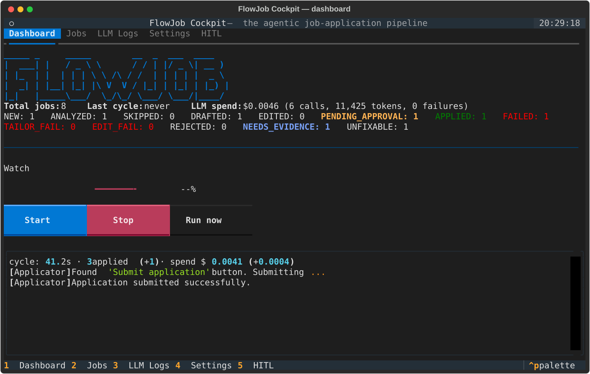
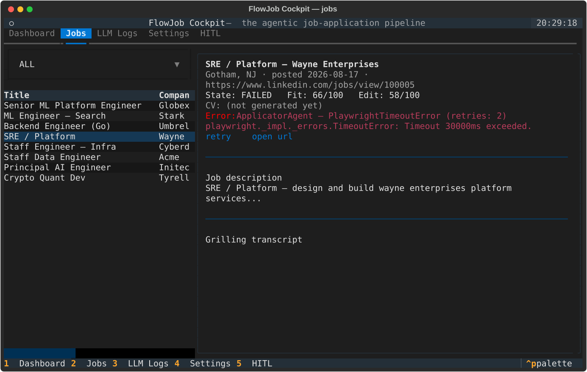
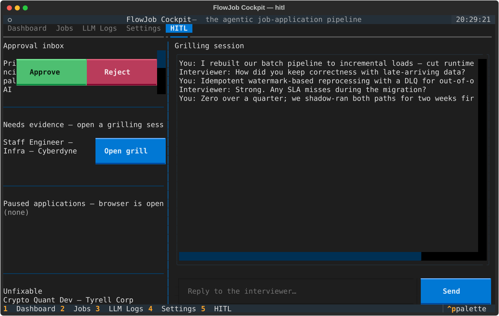
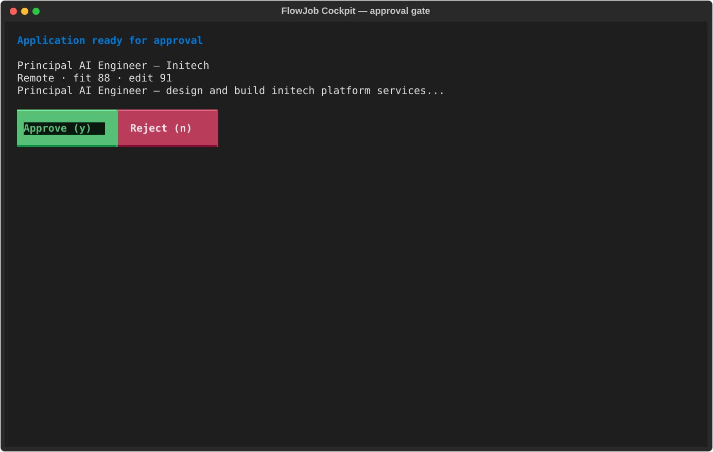
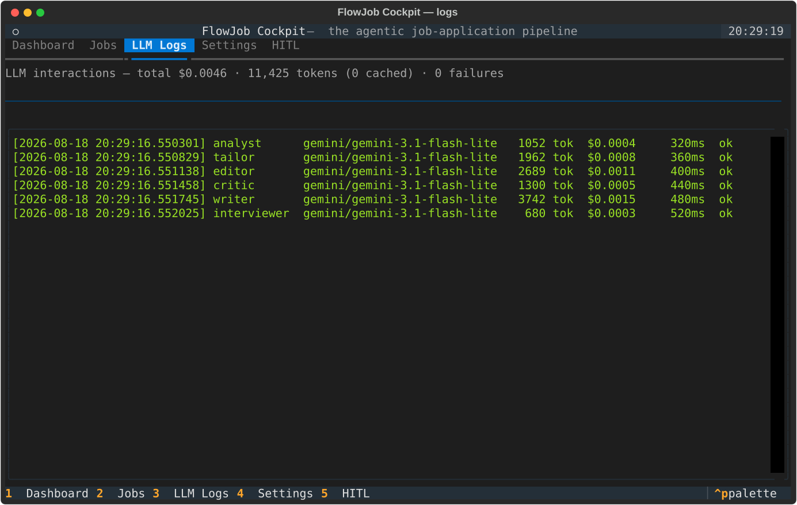
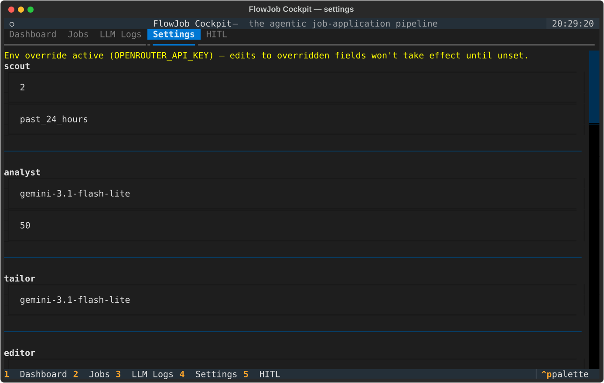

# FlowJob

Agentic job-application pipeline: scouts LinkedIn for jobs, scores fit, tailors
and edits a resume per job, evidences gaps via grilling, and applies through
LinkedIn Easy Apply — all from one SQLite database and one config file.

## Features

- Deterministic pipeline: scout → analyst → tailor → editor → critic/writer
  (evidence loop) → approval gate → applicator, with per-stage retry states
- Human-in-the-loop seams: approval gate before applying, grilling sessions for
  missing-evidence gaps, pause-on-unknown-form-field during Easy Apply
- **Cockpit TUI** (`flowjob tui`) — full-screen Textual front door: dashboard,
  job browser, LLM log viewer, settings editor, and in-TUI watch hosting
- Watch mode: continuous cycles with jittered countdowns, lockfile-guarded so
  CLI and TUI watchers never run concurrently

## Requirements

- Python >= 3.12
- TeX Live with `pdflatex` (resume PDFs compile through the Jake's Resume
  LaTeX template)
- Playwright + Chromium (`uv run playwright install chromium`)
- LinkedIn session: run `flowjob login` once (headed browser, saves auth state)
- An LLM provider reachable via the provider chain in `flowjob.yaml`
  (OpenRouter-compatible API), plus `OPENROUTER_API_KEY`
- A `master_resume.md` in the project root

## Quickstart

```bash
uv sync
uv run playwright install chromium
uv run flowjob validate          # parse master_resume.md, validate config, init DB
uv run flowjob login             # authenticate with LinkedIn (saves browser state)
uv run flowjob tui               # launch the cockpit
```

## Commands

| Command | Description |
| --- | --- |
| `flowjob validate` | Parse `master_resume.md`, validate `flowjob.yaml`, init the DB |
| `flowjob login` | Headed browser to authenticate with LinkedIn and save state |
| `flowjob run` | Run the pipeline once |
| `flowjob watch` | Run the pipeline continuously with jittered countdowns |
| `flowjob tui` | Launch the cockpit TUI |
| `flowjob status` | DB summary counts + last successful cycle timestamp |
| `flowjob add` | Log a manual application (filed by hand; title/company/url/jd/notes/cv/state/date-applied, all optional except at least one identifying field) |
| `flowjob update <id> --state X` | Flip any job's state (manual or pipeline) — e.g. `REJECTED` to track rejections |
| `flowjob audit-bank` | Audit the master resume bullet bank |
| `flowjob grill` | Start or resume a grilling session for a job needing evidence |
| `flowjob logs` | Browse persisted LLM request/response logs |

## The cockpit TUI

`flowjob tui` is the single front door to FlowJob. Five tabs (`1`–`5` to switch):

- **Dashboard** — state counts, last cycle, LLM spend, watch control row
- **Jobs** — state- and source-filtered table (manual/pipeline/all, with a
  `manual` badge) + detail pane (JD, notes, fit/edit scores, transcript,
  error block); actions: log a manual application (`m`), change state (`s`),
  approve/reject (`a`/`r`) on PENDING_APPROVAL, grill (`g`) on
  NEEDS_EVIDENCE, retry (`t`) on failed pipeline states, open URL (`o`),
  open resume (`d`) — all also clickable as buttons in the jobs pane
- **LLM Logs** — persisted interactions + spend totals
- **Settings** — structured forms for all `flowjob.yaml` sections with
  guardrail bounds; the `llm.providers` chain is edited manually in the YAML.
  Env overrides (`FLOWJOB_MODEL`, `OPENROUTER_API_KEY`) are shown in a warning
  banner; edits write file values
- **HITL** — approval inbox, needs-evidence grilling launcher, paused
  application continuations, unfixable list, grilling chat

Watch hosting: manual start/stop/restart, mm:ss countdown with "Run now",
stdout streamed to the watch log, per-cycle summary (counts, duration, spend
delta). The watch lockfile (`.flowjob-watch.lock`) prevents CLI/TUI watchers
from running concurrently.

## Screenshots

Real headless renders against a seeded demo database
(`uv run python scripts/screenshot_cockpit.py`):













## Configuration

`flowjob.yaml` at the project root (or `--config`). The `watch:` section is
optional; defaults are 45–90 minutes of jittered wait between cycles:

```yaml
watch:
  min_wait_minutes: 45
  max_wait_minutes: 90
```

`FLOWJOB_DB` overrides the database path; `FLOWJOB_DISPLAY` pins the display
for headed Playwright launches (VNC/SSH -X setups).

## Testing

```bash
uv run pytest            # unit + integration suites, Textual Pilot tests
uv run mypy src/tui src/pipeline/watch_lock.py src/pipeline/retry.py src/agents/applicator.py --explicit-package-bases
uv run python scripts/screenshot_cockpit.py   # regenerate docs/screenshots/*.svg
```