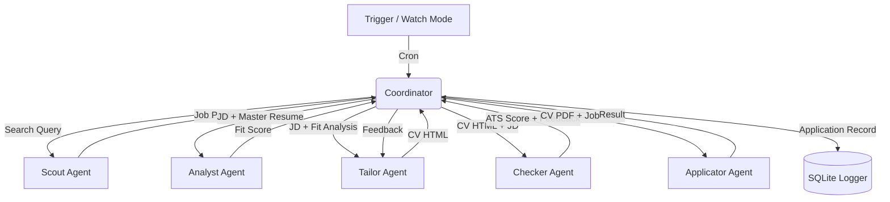

# FlowJob: Agentic Job Application Pipeline
## Design Specification v1.0

FlowJob is an automated, multi-agent pipeline built on the Google Antigravity SDK. It discovers job postings, analyzes fit, generates tailored resumes, simulates ATS/AI screening, and applies automatically via browser automation.

---

## 1. Architecture Overview

FlowJob uses a hybrid orchestration model: **Deterministic Python code drives the pipeline, while AGY SDK agents act as specialized processors at each stage.** This ensures reliable state management, typed data boundaries (via Pydantic), and robust error handling.

### Pipeline Topology



### 1.1 Watch Mode
FlowJob runs as a persistent process. It uses the AGY SDK's `every(seconds, callback)` trigger to wake up periodically, query the Scout Agent, and push new jobs through the pipeline.

---

## 2. Data Model

The pipeline relies on strict Pydantic schemas for data integrity between agents.

### 2.1 The Master Resume
The single source of truth for the user's career. It uses a hybrid format:
- **YAML Frontmatter**: Metadata (contact, links), Skills Taxonomy (languages, tools), Preferences (target roles, optional salary), and **Personal Nudge** (tone/flavor guidelines for the AI summary).
- **Markdown Body**: Exhaustive bullet points for all past experiences, tagged with `[brackets]` for semantic filtering.

### 2.2 Pydantic Schemas

*   **JobPosting**: `url`, `title`, `company`, `location`, `posted_date`, `jd_text`
*   **FitScore**: `score` (0-100), `matching_skills`, `missing_skills`, `recommendation`
*   **ATSScore**: `keyword_score`, `format_score`, `ai_recruiter_score`, `overall`, `feedback`, `pass_threshold`
*   **ApplicationRecord**: `id`, `company`, `role`, `date_applied`, `job_url`, `cv_path`, `ats_score`, `status`

---

## 3. Agent Specifications

Each agent has a dedicated `LocalAgentConfig`, system prompt, and custom tools.

### 3.1 Scout Agent
*   **Role**: Discover new job postings.
*   **Tools**: `scrape_linkedin_jobs(search_url)`
*   **Implementation**: Uses Playwright with a persistent `storageState` to bypass headless detection.
*   **Output**: `list[JobPosting]`

### 3.2 Analyst Agent
*   **Role**: Read the JD, compare it against the Master Resume and preferences, and score the fit.
*   **Tools**: None (pure LLM reasoning).
*   **Output**: `FitScore`. Jobs scoring below the configured threshold are dropped.

### 3.3 Tailor Agent
*   **Role**: The creative brain. Selects the most relevant bullets from the Master Resume and writes a custom summary based on the `personal_nudge`.
*   **Tools**: `generate_cv_html(data, template)`
*   **Output**: HTML string of the tailored CV (and optionally a Cover Letter).

### 3.4 Checker Agent
*   **Role**: The adversary. Simulates an ATS and an AI Recruiter.
*   **Tools**: `score_ats_compatibility(cv_html, jd)`
*   **Output**: `ATSScore`.
*   **Iteration Loop**: If the overall score is < 80, the Checker returns specific feedback. The Coordinator passes this feedback back to the Tailor Agent for a revision. **Max iterations: 3**.

### 3.5 Applicator Agent
*   **Role**: Submits the application.
*   **Scope v1**: LinkedIn Easy Apply only.
*   **Tools**: `submit_easy_apply(job_url, cv_pdf_path)`
*   **Implementation**: 
    *   Converts the Tailor's HTML to PDF via Playwright print-to-pdf.
    *   Uses Playwright Locator API (role/label-based, no brittle CSS classes).
    *   Implements a generic form handler to map field labels to config data.
    *   **Safety**: Hook-based rate limiting (max 15 apps/day) and randomized human-like delays (2-5s per action).

---

## 4. Configuration & Storage

### 4.1 Configuration
*   **`.env`**: Secrets only (e.g., API keys, LinkedIn credentials if used over persistent sessions).
*   **`flowjob.yaml`**: Preferences, rate limits, thresholds, and file paths.

### 4.2 Logging
*   **Database**: SQLite (`flowjob.db`).
*   **Dashboard**: Deferred for v1. Use `flowjob status` CLI command to query the SQLite DB and print a summary table.

---

## 5. Project Structure

*   **Tooling**: Managed by `uv`.
*   **Template**: Uses a modified version of `owengretzinger/html-resume-template`, converted from Tailwind to vanilla CSS, injected via Jinja2.

```
flowjob/
├── config/
│   ├── .env
│   └── flowjob.yaml
├── src/
│   ├── agents/           # Agent definitions (configs, prompts)
│   ├── tools/            # Python tools (scraping, applying)
│   ├── models.py         # Pydantic schemas
│   └── orchestrator.py   # Main pipeline logic
├── templates/
│   └── resume.html       # Vanilla CSS resume template
├── master_resume.md
├── flowjob.db            # SQLite log
└── pyproject.toml
```
